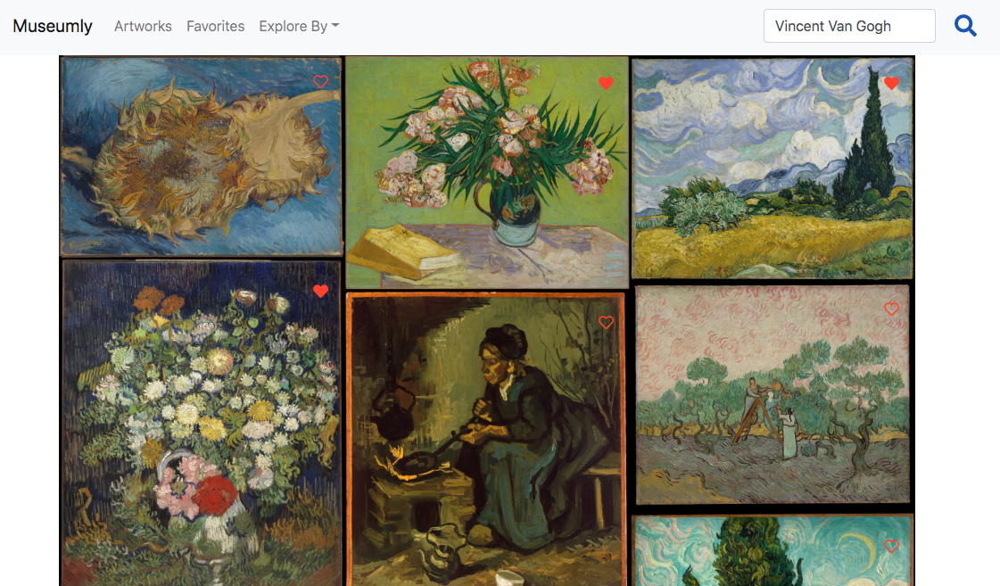

# Museumly

#### An Artwork Explorer

Museumly allows a user to view, search, and favorite artworks to curate their own collection using the Metropolitan Museum of Art Collection and Harvard Art Museums APIs. 

Visually, the app has a clean, intuitive, and seamless UI/UX to best showcase the artwork and provide value to the user.

#### Tech Stack:

- React
- React-Router
- JavaScript
- Node.js
- Express
- Axios
- MySQL
- Babel
- Webpack
- React-Bootstrap
- The Metropolitan Museum of Art Collection API
- Harvard Museums API

#### Screenshots of how the App works:

Users can explore collections by artist or art style/era, including Modern Art, European Paintings, and Drawings and Prints, using a continuous scrolling design pattern.

Users can search for specific artworks, view list of all artists in MySQL database, and click a heart to designate the artwork is a favorite and add to their curated collection.

